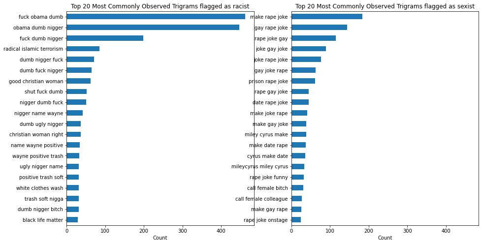

# Capstone Project: Identifying Offensive Tweets

# Information
This is my capstone project for the General Assembly Data Science Immersive course. 

**CONTENT WARNING: This project includes content that are sensitive and may be offensive to some viewers. These topics include mentions (many negative) and slurs of race, religion, and gender.**

**NOTE: All text information that are used in this project are directly taken from the websites and do not reflect what I believe in. All tags (whether a tweet is racist/sexist, or not) are taken as is from the source.**

For the purpose of this project, the offensive tweets of interest are ones that are racist and sexist. 

Racist tweets are defined as those that have antagonistic sentiments toward certain religious figures or individuals from a religious group, and/or individuals or groups from a certain race. Given the dataset 'classified_tweets' not separating the racist and sacrilegious/blasphemous (anti-religious) tweets, the 'racist' tag will be applied for both categories.

Sexist tweets are defined as those that have misogynistic, homophobic, and/or transphobic sentiments.

# Background
Twitter is a micro-blogging social media platform with 217.5 million daily active users globally. With 500 million new tweets (posts) daily, the topics of these tweets varies widely – k-pop, politics, financial news… you name it! Individuals use it for news, entertainment, and discussions, while corporations use them to as a marketing tool to reach out to a wide audience. Given the freedom Twitter accords to its user, Twitter can provide a conducive environment for productive discourse, but this freedom can also be abused, manifesting in the forms of racism and sexism

# Problem Statement

With Twitter’s significant income stream coming from advertisers, it is imperative that Twitter keeps a substantial user base. On the other hand, Twitter should maintain a safe space for users and provide some level of checks for the tweets the users put out into the public space, and the first step would be to identify tweets that espouse racist or sexist ideologies, and then Twitter can direct the users to appropriate sources of information where users can learn more about the community that they offend or their subconscious biases so they will be more aware of their racist/sexist tendencies. Thus, to balance, Twitter has to be accurate in filtering inappropriate tweets from innocuous ones, and the kind of inappropriateness of flagged tweets (tag - racist or sexist).

F1-scores will be the primary metric as it looks at both precision and recall, each looking at false positives (FPs) and false negatives (FNs) respectively, and is a popular metric for imbalanced data as is the case with the dataset used.

For the purpose of explanation, racist tweets are used as the ‘positive’ case.

In this context, FPs are the cases where the model erroneously flags out tweets as racist when the tweet is actually innocuous/sexist. FNs are cases where the model erroneously flags out tweets as innocuous/sexist but the tweets are actually racist.

There is a need to balance the identification of an offensive tweet when it is indeed offensive and the need to maintain a high level of user experience (something that would be jeopardized when the model erroneously flags innocuous tweets as offensive).

Thus, higher F1-score is the preferred metric to assess model performance.

# Data Dictionary
The following datasets are gathered from 2 main sources:
1. [classified_tweets](https://www.kaggle.com/datasets/munkialbright/classified-tweets)
This will be used as the training dataset.

2. [cyberbullying_tweets](https://www.kaggle.com/datasets/andrewmvd/cyberbullying-classification)
This will be used as the test dataset.

### classified_tweets
|Feature| Type| Description|
|---|---|---|
|text| int| Tweets|
|suspicious| int| 1: suspicious, 0: not suspicious|
|cyberbullying| int| 1: racism, 2: sexism, 0: neither|
|hate| int| 1: hate speech, 0: not hate speech|
|suicidal| int|1: text with suicidal intent, 0: no suicidal intent|

### cyberbullying_tweets
|Feature| Type| Description|
|---|---|---|
|tweet_text| string| Tweets|
|Annotation| string| Tags showing if the tweet is innocuous (not_cyberbullying), or offensive (age, ethnicity, gender, religion, other_cyberbullying)|

# Cleaning Data
The text data are cleaned using the usual NLP preprocessing steps:
* Removing non-texts (emojis)
* Removing hashtags and URLs
* Converting texts to lowercase
* Removing punctuations
* Lemmatizing with Part-of-Speech (POS) tagging
* Removing back-to-back trailing spaces
* Update list of stop words
* Removing stop words

# Exploratory Data Analysis

### Tweet Length Analysis

It can be observed that the distribution of tweet length is bimodal, with the two peaks around 8 and 24 word count.

### Word n-grams

#### Unigram

For the unigrams from tweets flagged as racist, there are:

-   expletive: fuck
-   mentions of race: white, black (with the n-word slur)
-   insult: dumb
-   mentions of Abrahamic faith: muslim, christian
-   mentions of extremism: terrorist

For the unigrams from tweets flagged as sexist, there are:

-   mentions of sexual assault: rape
-   mentions of gender: woman, female, men, girl
-   insult: dumb
-   mentions of sexuality: gay
-   mentions of mkr - stands for My Kitchen Rules, an Australian competitive cooking game show that has shown scenes where contestants hurled sexist remarks to female contestants, and where discussions online has garnered significant misogynistic sentiments
-   expletive: fuck

#### Bigram

For the bigrams from tweets flagged as racist, there are:

-   directed insults: dumb and fuck found before and after the mention of the n-word - this gives us more information on the recipient of most racist tweets
-   attack on polical figures: fuck obama - Barack Obama is the first black President of the United States, another attack on the black community
-   mentions of other demography: christian woman, white people - this gives us more information about the other profiles of people involved in racist tweets
-   links to religious extremism: islamic terrorism, radical islamic - the extremism mentioned in tweets are those relating to islam

For bigrams from tweets flagged as sexist, there are:

-   downplaying/dismissal of severe/sensitive topics: permutations and combinations of the words 'rape', 'gay', joke'
-   mention of celebrity: miley cyrus - an American singer-songwriter who was in the spotlight for making a date-rape joke at a club gig

#### Trigram

For the trigrams from tweets flagged as racist, there is not much additional information we can gather that we did not from bigrams, though an additional piece of information uncovered here is the mention of black life matter, which is a decentralized political and social movement that strives to highlight the discrimination, racism, and inequality that the black community face.

For the trigrams from tweets flagged as sexist, there is also not much additional information we can gather that are not already seen from bigrams.

# Modelling

##### Note that the pickled model for BERT 50 Epochs is not found on the GitHub due to its file size. But it can be found here:

[BERT 50 Epochs](https://drive.google.com/file/d/11TodNIbnfzhRyW_iNAcNP_Quh5cs6868/view?usp=sharing)

The models that are trained are:
* Multinomial Naive Bayes
* Random Forest
* Support Vector Machine (SVM)
* Bidirectional Encoder Representations from Transformers (BERT) 50 Epochs

|Model| F1-score (Train)| F1-score (Validation)| F1-score (Test)|
|---|---|---|---|
|Multinomial Naive Bayes| 0.922| 0.889| 0.640|
|Random Forest| 0.999| 0.931| 0.883|
|Support Vector Machine| 0.963| 0.927| 0.882|
|BERT 50 Epochs| 0.999| 0.927| 0.856|

Based on the F1-scores from the test dataset, the random forest model is the best performing model, with the SVM model of  being a close second.