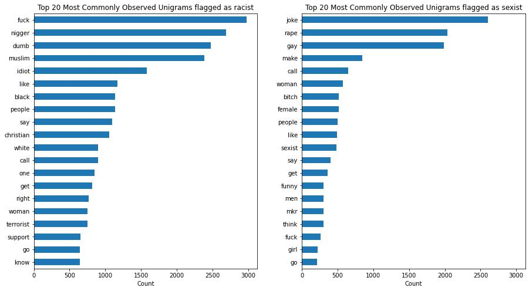

# Capstone Project: Identifying Offensive Tweets

# Background
Twitter is a micro-blogging social media platform with 217.5 million daily active users globally. With 500 million new tweets (posts) daily, the topics of these tweets varies widely – k-pop, politics, financial news… you name it! Individuals use it for news, entertainment, and discussions, while corporations use them to as a marketing tool to reach out to a wide audience. Given the freedom Twitter accords to its user, Twitter can provide a conducive environment for productive discourse, but this freedom can also be abused, manifesting in the forms of racism and sexism.

# Problem Statement

With Twitter’s significant income stream coming from advertisers, it is imperative that Twitter keeps a substantial user base. On the other hand, Twitter should maintain a safe space for users and provide some level of checks for the tweets the users put out into the public space, and the first step would be to identify tweets that espouse racist or sexist ideologies, and then Twitter can direct the users to appropriate sources of information where users can learn more about the community that they offend or their subconscious biases so they will be more aware of their racist/sexist tendencies. Thus, to balance, Twitter has to be accurate in filtering inappropriate tweets from innocuous ones, and the kind of inappropriateness of flagged tweets (tag - racist or sexist).

F1-scores will be the primary metric as it looks at both precision and recall, each looking at false positives (FPs) and false negatives (FNs) respectively, and is a popular metric for imbalanced data as is the case with the dataset used.

For the purpose of explanation, racist tweets are used as the ‘positive’ case.

In this context, FPs are the cases where the model erroneously flags out tweets as racist when the tweet is actually innocuous/sexist. FNs are cases where the model erroneously flags out tweets as innocuous/sexist but the tweets are actually racist.

Thus, higher F1-scores are preferred.

# Data Dictionary
The following datasets are gathered from 2 main sources:
1. [Mendeley Data](https://data.mendeley.com/datasets/jf4pzyvnpj/1)
Unfortunately at the date of writing this README file, the datasets have been removed. Of the datasets available, only twitter_parsed_dataset is used.

Though having said that, there is a combined version of the texts in [kaggle](https://www.kaggle.com/datasets/prmethus/mendeleys-cyberbully-datasets-combined). But that dataset does not differentiate the inappropriateness tags of the tweets.

2. [kaggle](https://www.kaggle.com/datasets/andrewmvd/cyberbullying-classification), this dataset is used as a test set that is truly unseen by the models. And some mapping of tags have to be done to match those from the Mendeley Data site.

### twitter_parsed_dataset
|Feature| Type| Description|
|---|---|---|
|index| int| Index of tweet|
|id| int| Same as Index|
|Text| string| Tweets gathered|
|Annotation| string| Tags showing if the tweet is innocuous (none), sexist (sexism), or racist (racism)|
|oh_label| int|0 refers to innocuous, 1 refers to offensive - sexist or racist|

### cyberbullying_tweets
|Feature| Type| Description|
|---|---|---|
|tweet_text| string| Tweets gathered|
|Annotation| string| Tags showing if the tweet is innocuous (not_cyberbullying), or offensive (age, ethnicity, gender, religion, other_cyberbullying)|

# Cleaning Data
The text data are cleaned using the usual NLP preprocessing steps:
* Removing non-texts (emojis)
* Removing hashtags and URLs
* Converting texts to lowercase
* Expanding contractions
* Removing punctuations
* Removing back-to-back trailing spaces
* Update list of stop words
* Removing stop words

# Preprocessing Data
After cleaning, 2 versions of texts are created:
1. Stemmed text
2. Lemmatized text, with consideration for POS tagging

# Feature Engineering
After preprocessing,  character bigrams, trigrams, and 4-grams are created from the stemmed and lemmatized texts.

# Exploratory Data Analysis

### Tweet Length Analysis

It can be observed that majority of tweets are short consisting of 10 words or less, constituting 75% of tweets in the dataset.

EDA is conducted separately on word and character n-grams, with the most commonly observed n-grams from offensive tweets plotted below:

### Proportions of Tweet tags

### Word n-grams

##### Word unigram

It can be observed that unigrams from tweets flagged as racist are largely centred around females. mkr stands for My Kitchen Rules, a reality cooking competition, and its hashtag #mkr contains many sexist comments on Twitter.

Those flagged as racist have significant anti-religious sentiments, primarily centered around the Abrahamic faiths (Islam, Christianity, and Judaism), with references to fundamentalists and extremists ('ISI' or ISIS, lemmatized/stemmed the second 's' away, and 'terrorist').

##### Word bigram

Commonly observed bigrams from tweets flagged as sexist are still centered around My Kitchen Rules, and many tweets contain the word 'sexist'.

At this level, it can be seen that the 2 most common themes are about calling out or recognizing sexism. Though upon further investigation, these tweets frequently contain phrases such as 'call me sexist but... (follows by something sexist)', or 'i'm not a sexist but... (follows by something sexist)'.

Commonly observed bigrams from tweets flagged as racist show similar themes as seen in unigrams.

Interestingly, the bigram '1400 year' and 'humanity 1400' are now highlighted when previously in unigrams, neither of the terms '1400' and 'humanity' are highlighted, alongside the lack of mentions of 'isi' (ISIS) despite it being a frequently observed unigram. Also, there are mentions of girls which are not seen in the unigrams.

However, at the bigram level, there is not much information about the references to '1400 year', i.e. what happened around year 1400 or what happened about 1400 years ago? Based on the top few frequently observed bigrams, a guess can be made about some declaration of war at that point in history.

##### Word trigram

Commonly observed trigrams from tweets flagged as sexist see that the words 'sexist' and 'mkr' are still dominant.

With more granularity, the 'call sexist' bigrams is now split into more variants but these variants do not give any more information about those tweets seen in the bigrams.

Commonly observed trigrams from tweets flagged as racist gives us more certainty about what happened about 1400 years ago as compared to bigrams.

Based on the results, it seems that 1400 years ago, there was some declaration of war on humanity. There is more information about the treatment of Jews (beheadment).

Interestingly, there is the first mention of a non-Abrahamic faith in a tweet flagged as racist, i.e. Hinduism.

### Character n-grams

##### Character bigram

Unlike the case of word bigram, character bigrams do not offer much information on the frequently observed terms, which is not a large concern since lower levels of character n-grams are just 2 letters whose primary objective is showing the 2 common consecutive letters of words from those flagged tweets.

##### Character trigram

For character trigrams from tweets flagged as sexist, there are notable terms that are also highlighted from character trigrams such as 'mkr', 'kat', and parts of the words 'sexist', 'sexism', and 'woman'.

For character trigrams from tweets flagged as racist, parts of the word 'islam' and 'muslim' are apparent.

##### Character 4gram

For character 4-grams from tweets flagged as sexist, there is not much additional information gathered other than the mention of the word 'feminism'.

For character trigrams from tweets flagged as racist, as compared to the character trigrams, notable parts of the name 'Prophet Mohammed' can be observed.

# Modelling

##### Note that the pickled models for random forest, BERT 2 Epochs, and BERT 10 Epochs are not found on the GitHub due to their file sizes. But they can be found here:

[Random Forest](https://drive.google.com/file/d/1uWOGoDroFYz4J6khWzhdhDAg5zAERd-h/view?usp=sharing)

[BERT 2 Epochs](https://drive.google.com/file/d/1mebA1ejNdTaHzi0b7yG0VpPsQwBZpo_V/view?usp=sharing)

[BERT 10 Epochs](https://drive.google.com/file/d/1Q-nRkimqOtkytDDm4lFw6N3B7y8V4qAu/view?usp=sharing)

The first model is Multinomial Naive Bayes. This is done to select which text configuration (which word or character n-gram to select) to use for the other models. The results of the Multinomial Naive Bayes models are as follows:

|Configuration| F1-score|
|---|---|
|Best Stemmed Text n-gram| 0.769|
|Best Lemmatized Text n-gram| 0.769| 
|Character bigram based on Stemmed Text| 0.743|
|Character trigram based on Stemmed Text| 0.777|
|Character 4gram based on Stemmed Text| 0.779|
|Character bigram based on Lemmatized Text| 0.740|
|Character trigram based on Lemmatized Text| 0.775|
|Character 4gram based on Lemmatized Text| 0.781|

Based on the F1-scores, we will go with character 4grams based on lemmatized text as it has the highest score.

Using character 4grams based on lemmatized text, the other models that are trained are:
* Random Forest
* Support Vector Machine (SVM)
* Bidirectional Encoder Representations from Transformers (BERT) 2 Epochs
* Bidirectional Encoder Representations from Transformers (BERT) 10 Epochs

|Model| F1-score|
|---|---|
|Multinomial Naive Bayes| 0.781|
|Random Forest| 0.728| 
|Support Vector Machine| 0.749|
|BERT 2 Epochs| 0.790|
|BERT 10 Epochs| 0.800|

Based on the F1-scores, the BERT models are the best performing, with the baseline model of Multinomial Naive Bayes being a close second.

However, given the training times of the model, the Multinomial Naive Bayes might be a more feasible, go-to model when time is of the essence.

|Model| Train Time (minutes)*|
|---|---|
|Multinomial Naive Bayes| 1|
|Random Forest| 58| 
|Support Vector Machine| 54|
|BERT 2 Epochs| 218 (~3.5 hours)|
|BERT 10 Epochs| 903 (~15 hours)|

*Train times of the models are rounded up to the closest minute.
