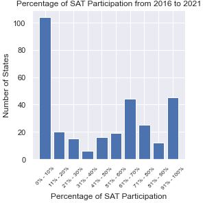
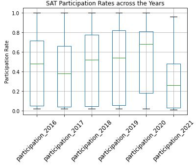
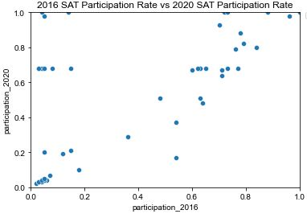
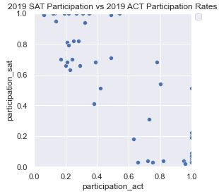

# Problem Statement
The new format for the SAT was released in March 2016. Since then, levels of participation in multiple states have changed with varying legislative decisions. This project aims to explore trends in SAT participation for the years 2016 to 2021, seeks to identify profitable opportunities in the market segments, and to advice College Board on targeted methods that they can engage in to increase SAT participation rates.

# Data Used
The data used is a combination of provided data as well as external data from the web. 

Internal data used consists of:
1. 2017 SAT Scores by State
2. 2018 SAT Scores by State
3. 2019 SAT Scores by State
4. 2019 ACT Scores by State

External data used consists of:
 1. 2016 SAT Scores by State
 2. 2020 SAT Scores by State
 3. 2021 SAT Scores by State

The data dictionary of the two datasets used are as follows:
### sat_participation_2016_to_2021
|Feature|Type|Dataset|Description|
|---|---|---|---|
|state|object|2017 SAT Scores by State|Shows the list of 50 states to be used for study|
|participation_2016|float|2016 SAT Scores by State|Shows the participation rate of the 2016 cohort in each state|
|participation_2017|float|2017 SAT Scores by State|Shows the participation rate of the 2017 cohort in each state|
|participation_2018|float|2018 SAT Scores by State|Shows the participation rate of the 2018 cohort in each state|
|participation_2019|float|2019 SAT Scores by State|Shows the participation rate of the 2019 cohort in each state|
|participation_2020|float|2020 SAT Scores by State|Shows the participation rate of the 2020 cohort in each state|
|participation_2021|float|2021 SAT Scores by State|Shows the participation rate of the 2021 cohort in each state|

### test_participation_2019
|Feature|Type|Dataset|Description|
|---|---|---|---|
|state|object|2017 SAT Scores by State|Shows the list of 50 states to be used for study|
|participation_sat|float|2019 SAT Scores by State|Shows the participation rate of the 2019 cohort in each state|
|participation_act|float|2019 ACT Scores by State|Shows the participation rate of the 2019 cohort in each state|

# Findings
In the process of this projects, several insights are uncovered that would promote informed decision-making in capitalizing on profitable opportunities.

The bar plot titled **Percentage of SAT Participation from 2016 to 2021** showing the aggregate number of states having the various levels of SAT Participation Rates across the years shows that most states fall in the categories of very low SAT participation (0% to 10%), moderate-high (61% to 70%), and very high (91% to 100%).

This goes against the general assumption that large sets of data follow a normal distribution.

The box plot titled **SAT Participation Rates across the Years** shows the generally increasing trend of SAT participation across the nation.

This means that there are more states that have higher SAT participation rates.

The scatter plot titled **2016 SAT Participation Rate vs 2020 SAT Participation Rate** shows that there is a relatively strong positive relationship between SAT participation rates in 2016 and 2020.

This might suggest that existing marketing and promotions College Board that engages in have a relatively long-lasting locking-in effect. In addition, based on the points at the top left portion of the grid, it can be said that College Board's method of acquiring schools and states of adopt the SAT examinations is successful given that those states have a very low participation in 2016 but have achieved an upwards of 60% participation in 2020. On the other hand, it can be observed that in states where there are low SAT participation rates in 2016, College Board has not made much headway in promoting a higher participation rate.

The scatter plot titled **2019 SAT Participation vs 2019 ACT Participation Rates** shows that there are numerous states where students do both ACT and SAT.

It can be seen that a significant reason when there is a low participation rate for one exam, there is a high participation rate for the other. This is observed from how when a point is high on the the participation_sat (horizontal axis), the same point is located very left along the participation_act.

This trend can is continuted to be observed not just in the extreme points but in the intermediate ones as well, evident from how the points in the middle of the grid form a downward sloping line.

This would indicate that the College Board should not be focusing their resources on the students in states who neither takes the SAT not ACT (which are not many), but rather focus on being a better fit for the admissions criteria of universities in states where ACT have a strong presence and agreements with schools and legislators in those states.
Though it can be odd to see states that has participation of 1 (i.e. 100%) for SAT and yet have non-zero ACT participation rates, it is not a worrying sign for College Board as it means that students in those states not only partake in SAT, but the ACT as well, and in those scenarios, they are not of the highest concern as they are already SAT takers. On that note, points around the bottom right of the grid (high participation of ACT but less of SAT) is a potential market for College Board to look at.

# Conclusions and Recommendations
Based on the analysis and visualizations, the recommendation to College Board would be to continue with the same method of maintaining their influence over states with high SAT participation rates, such as having agreements with state legislators to have schools in that state make it compulsory for students to do the SAT, and through that connection, offer other offerings such as PSAT and AP exams, which bring in [more stream of significant income](https://www.forbes.com/sites/susanadams/2020/09/30/the-forbes-investigation-how-the-sat-failed-america/?sh=28075db353b5) . Some states that fall under this category are Rhode Island and Illinois. On top of that, College Board can tap on their online capabilities to hold University Day (especially since [SAT are now online](https://www.cnbc.com/2022/01/25/the-sat-will-go-fully-onlineand-take-just-two-hours.html)) to have students attend a virtual university open house of sorts without any inconveniences of existing of possible COVID-19 disruptions to in-person large scale events.

For states where the state has have agreements with ACT Inc., College Board can still capitalize in those states by marketing to students and parents by showing them that SAT are a viable alternative to ACT and since all universities accept either of them, can convince them taking the SAT can act as a failsafe backup should their ACT results do not match their expectations. And there seems to be evidence of a sizeable part of the student population who are willing to do both examinations, displayed in the second scatter plot and explained by its analysis. College Board can also aggressively promote the SAT to the regulators for SAT to be the primary standardized exam as with the case of Michigan. Some states that fall under this category would be Missouri, Nebraska, and Kentucky.

As for states that do not make the SAT or ACT compulsory, College Board can market to students and parents as stated above, but also work closely with universities so that the skills and knowledge tested in SAT can better match the pre-requisite knowledge required for the entry level modules. Moreover, College Board can directly work with universities to have them only consider applications that are include their SAT scores.

For future studies, having a clearer idea of marketing and implementation costs when it comes to lobbying for making the SAT compulsory or setting up the systems with regulators and school administrators to ensure a seamless exam administration and reporting workflow would allow for more detailed analysis. That would entail a cost-benefit analysis that can uncover opportunities that might look profitable but are loss making when accounting for the said high set-up costs or the lack of economies of scale.
