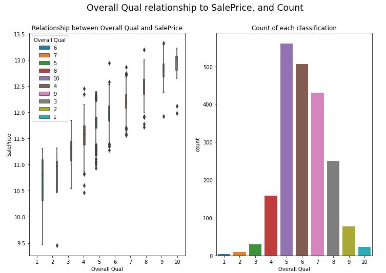
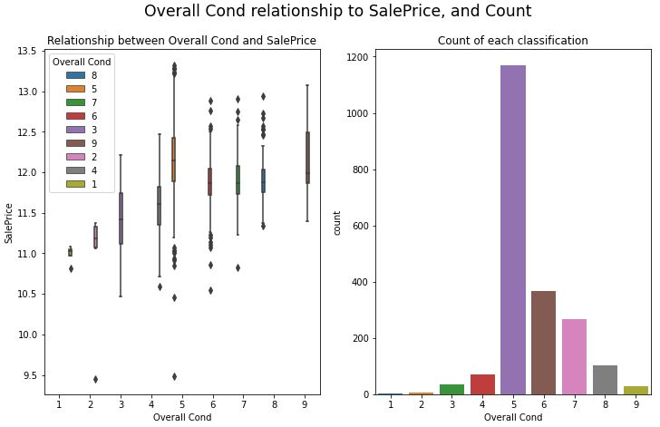

# Project 2

## Background
The buying and selling of home properties is a big issue for many Americans given that some properties may be costly, and relocating for work or personal reasons is commonplace in countries as large as USA. Alongside relocation comes the buying and selling of properties, and immigrants and emigrants of Ames, Iowa are no exception. Like everyone, they would want to negotiate and buy/sell their property for a price that is deemed reasonable by the market (as observed from past SalePrice), and hopefully minimize their losses (if the owners are desperate) or make a little profit off the transaction.

## Problem Statement
Given the self-interest of both the buyer and seller (or through their agents), there are many opportunity for people to capitalize on the asymmetric information of the other party by exploiting them in the form of under/over quoting them. To address this issue, my data-driven and savvy team of property agents can better advice our clients on the SalePrice they can expect to get in a fair trade, and can act as a benchmark when it comes to negotiations. With the opening up borders and inter-state travelling returning, there is greater need for our advice and we will not only predict the expected house prices, but also the key areas of improvement homeowners can engage in to increase their chances of fetching a higher price when selling.

## Data Used
* ['test.csv'](./data/test.csv): Characteristics of houses sold and their sale price.
* ['train.csv'](./data/train.csv): Characteristics of houses sold without their sale price.

## Data Generated
* ['train.csv'](./data/train.csv): Characteristics of houses sold and their sale price.

## External Data used:
The following link provides information on the minimum lot area of the various regions in Iowa. This can be used for data cleaning purposes as any observations that has a Gr Liv Area (Above grade ground living area square feet) can be reassigned to take on that minimum value:
https://www.cityofames.org/home/showdocument?id=35206

## Cleaning Data
First, there is a need to clean data. This comes in the form of handling missing data and converting datatypes based on discretion and reference to the data dictionary provided. This is because there cannot be missing values when running linear regression, lasso regression, and ridge regression models.

There were 4 variables that had too many missing values (more than 80% of the entire dataset or 1640) and are dropped. They are Pool QC, Misc Feature, Alley, Fence.

In the interest of time, missing continuous numerical data are imputed using the mean, while categorical data are imputed using the mode.

Included in this step is also the changing of data type for a few variables, they are as follows:
* MS SubClass - from integers to string this is because they are considered categories, but have names to those categories as numbers e.g. 85 representing the property has a split foyer. 

* Mo Sold - from integer to strings, as I would like to look for any seasonality effect across each year by converting integers into their respective months, e.g. 1 converted to Jan

* Overall Qual and Overall Cond - from integer to strings, changing datatype to string, to be used as ordinal data, 1 as the worst and 10 being the best.

##  Feature Engineering
To start, 3 new features are made:
* PropertyAge: Year Built - Yr Sold
* PropertyModAge: Year Remod/Add - Yr Sold
* GarageAge: Garage Yr Blt - Yr Sold
Year Built, Year Remod/Add, and Garage Yr Blt are dropped from the dataset.

Based on plots shown later and on hindsight, two new features are made:
* Gr Liv Area2: the square of Gr Liv Area
* Total Bsmt SF2: the square of Total Bsmt SF

Gr Liv Area and Total Bsmt SF are not dropped from the dataset.

These variables are at attempt to tease out the polynomial symbols discussed later and it seem to pay off given that the ridge regression's (chosen model) cross validation RSME is reduced by about 2000.

## Exploratory Data Analysis (EDA)
Using the correlation heatmap, we can sieve out which of the following numerical variables are highly correlated with SalePrice, our target variable.

Due to the large number of numerical variables, the entire heatmap is not shown here, but a column of it is included. It shows the level of influence each of the numerical variables have on SalePrice

The lowly correlated ones (a threshold I set as absolute correlation being under 0.05) are removed from the dataset. They are:
* 3Ssn Porch
* Pool Area
* BsmtFin SF 2
* Misc Val
* Yr Sold
* Low Qual Fin SF
* Bsmt Half Bath

For each of the categorical variables, there are 2 subplots, the left shows the boxplots for each of the categories while the right displays the bar plot showing the count of each categories observed in the dataset.

Through the EDA process, there are many categorical variables are deemed not useful.

However, given the composition of observations, there are many characteristics (categorical variables) where one or two categories are disproportionately represented and are not useful for analysis and hence dropped.

These variables are:
- Mo Sold
- MS Zoning
- Street
- Land Contour
- Utilities
- Lot Config
- Land Slope
- Condition 1
- Condition 2
- Bldg Type
- Roof Style
- Roof Matl
- Exterior 2nd
- Exter Cond
- Bsmt Cond
- BsmtFin Type 2
- Heating
- Central Air
- Electrical
- Functional
- Garage Qual
- Garage Cond
- Paved Drive
- Sale Type

### Interesting Findings
It should come as no surprise that the better the quality of a house is, the higher the price it can fetch as compared to another with a lower quality, ceteris paribas. This is seen here:

However, when we look at the remapped version of Overall Cond (a very similar quality to Overall Qual):

It can be observed that the organization/ third party individual giving the rating might not be very sharp in discerning properties in good condition and those in bad conditions, given that properties that are rated higher are fetching a lower price when looking at the median.

However, based on the results of our chosen model (Ridge Regression), the coefficient of Overall Cond_High is stronger than Overall Cond_5, which is in direct conflict with the plot.

## More Data Preprocessing
In order to obtain models that are stable (i.e. have minimal coefficients that are not too drastically different in magnitude), there is a need for normalizing. 

To do so, the dataset is split based on their type. Numerical data are normalized while categorical data are one-hot-encoded.

Lastly, the dataset is separated using the train/test split.

## Running Machine Learning Models
Across the 3 models, the cross validation fold is set to 5 for consistency. The metrics of the models will be shown later.

### Linear Regression
The linear regression is first conducted and will act as the baseline model. 

When plotting the actual SalePrice is against the SalePrice predicted by the Linear Regression model, the result is as follows:

It can be observed that for properties that are sold for more than $350,000 the linear regression tend to underestimate.

### Lasso Regression
The optimal alpha is first calculated using cross validation, which will then be used to train the lasso regression using the train data. It is then trained on the explanatory variables in the testing data and compared against the actual SalePrice in the test set.

When plotting the actual SalePrice is against the SalePrice predicted by the Lasso Regression model, the result is as follows:

Unlike the plots from Linear Regression and Ridge Regression, the plot for Lasso Regression seems to deviate the most from the line of equality (the dotted red line). For properties expecting to be sold at a lower price (~$180,000), Lasso Regression tend to overestimate, and price of properties above that price point tend to be underestimated.

### Ridge Regression
The optimal alpha is first calculated using cross validation, which will then be used to train the ridge regression using the train data. It is then trained on the explanatory variables in the testing data and compared against the actual SalePrice in the test set.

When plotting the actual SalePrice is against the SalePrice predicted by the Ridge Regression model, the result is as follows:

The rounded Root Mean Squared Error (RMSE) is the choice of metric and are as follows:
|Model| Train RMSE | CV RMSE | Comment|
|---|---|---|---|
|Linear Regression|26,613|26,435|Baseline Model
|Lasso Regression|65,493|60,774| Worst Performing Model
|Ridge Regression|26,548|26,364| Best Performing Model

Based on the merits of having the lowest cross validation RMSE, the Ridge Regression model is selected.

## Residual Analysis
#### Linear Regression
Plotting the predicted SalePrice using the Linear Regression against its residuals, we have the following:

It can be observed that the bulk of residuals are around 0, and that the assumption of homoskedasticity is mostly held, especially where prices are not very high or very low. 

#### Lasso Regression
Plotting the predicted SalePrice using the Lasso Regression against its residuals, we have the following:

It can be observed that there is a clear relationship between the Lasso Regression predicted SalePrice and its residuals as illustrated by the purple line. This could be due to the a linear model is not the best model in this case.

#### Ridge Regression
Plotting the predicted SalePrice using the Ridge Regression against its residuals, we have the following:

Similar to Linear Regression, it can be observed that the bulk of residuals are around 0, and that the assumption of homoskedasticity is mostly held, especially where prices are not very high or very low. 

## Results from Ridge Regression
Since the Ridge Regression is our chosen model, we can use it to analyze the most influential variables in affecting SalePrice.
 
 A plot of the Ridge Regression's most influential variables are as shown:

Looking at the top 10 most influential variables, we can focus on a few variables, namely:
* Overall Qual - get a very high classification
* Exter Qual - get an excellent classification
* Kitchen Qual - get an excellent classification
* MS SubClass - renovate house to be [020] 1-STORY 1946 & NEWER ALL STYLES, [030] 1-STORY 1945 & OLDER, [050] 1-1/2 STORY FINISHED ALL AGES, [060] 2-STORY 1946 & NEWER, [070] 2-STORY 1945 & OLDER
* Overall Cond - get a high classification

## Kaggle Submission
In the first submission, I received a less than delightful score:

Looking deeper in my prediction, I plotted the Ridge Regression predicted SalePrice alongside actual SalePrice provided in the train csv.

Looking at the predicted SalePrice, it is observed that there is not much of a right tail, this could be due to the fact that my imputation methods are central leaning (using mean and mode) and/or that there are not many data points available for properties with high SalePrice.

Also, looking at the horizontal axis, there seems to some negative bias of about $110,000.

After applying a rightward shift (adding $110,000 to all predicted SalePrice)  and plotting it, the SalePrice values seem to match better:

This is also reflected in the improved Kaggle score in the second submission with the shifted SalePrice.

This bias might be indicative of underfitting of the model.

## Main Takeaways and Future Steps

1. The clearest, unambiguous way to increase the SalePrice would be to maintain a high quality of the external of the property, maintain a high quality of the kitchen, and to finish the 1/2 story (if your property has an unfinished 2nd floor, referring to MS SubClass 50 above).

2. 

Based on the following plots shown above:
- Actual vs Expected SalePrice plots,
- Lasso Regression's residual plots, and 
- Two plots of histograms of the predicted SalePrice for kaggle and the actual SalePrice observed

All of them strongly suggest that a lot of data points for properties that are expected to fetch a high SalePrice (>$ 350,000) are required for existing models to better predict those properties, or that a separate model that seems non-linear (seemingly a log model or any other model with an increasing concave down form will better fit those data points.

3.  Need to check for weakness in the model used, such as residual analysis to test homoskedasticity, underfitting/overfitting from the bias/variance respectively, and any conflicting sign that may indicate some level of omitted variable bias.