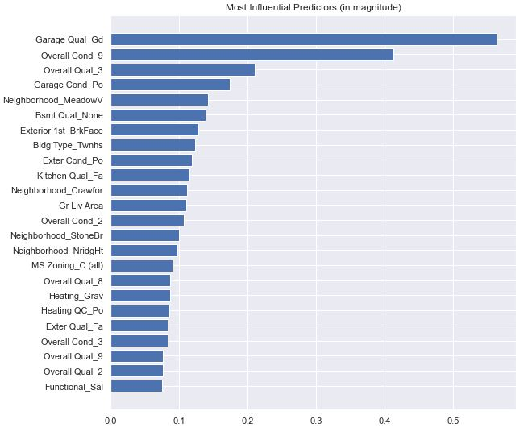

# Project 2: Ames Housing Sale Price Prediction Project

# Information
This project is based on a kaggle challenge:
https://www.kaggle.com/c/dsi-us-11-project-2-regression-challenge

# Background
The buying and selling of home properties is a big issue for many Americans given that some properties may be costly, and relocating for work or personal reasons is commonplace in countries as large as USA. Like everyone, buyers and sellers would want to negotiate and buy/sell their property for a price that is deemed reasonable by the market (as observed from past SalePrice), and hopefully minimize their losses (if the owners are desperate), and if possible, make a little profit off the transaction.

# Problem Statement
Given the self-interest of both the buyer and seller (or through their agents), there are many opportunity for people to capitalize on the asymmetric information of the other party by exploiting them in the form of under/over quoting them. To address this issue, my data-driven team of property agents developed a pricing model so that we can better advice our clients on the SalePrice they can expect to get in a fair trade, and the model's predictions can act as benchmarks to be used in negotiations. With the opening up borders and inter-state travelling returning, it is expected that there will be a greater need for our service and we will not only predict the expected house prices, but also the key areas of improvement homeowners can engage in to increase their chances of fetching a higher price when selling.

As a starting point, my team has identified the city of Ames in Iowa to be the first city to embark on this project.

Based on the challenge information, the metric of interest of the models will be Root Mean Square Error (RMSE).

# Data Used
* ['test.csv'](./data/test.csv): Characteristics of houses to base the predicted sale price on.
* ['train.csv'](./data/train.csv): Characteristics of houses previously sold with their sale price.

# Data Cleaning
First, there is a need to clean data. This comes in the form of handling missing data and converting datatypes based on discretion and reference to the data dictionary provided. This is because there cannot be missing values when running Ordinary Least Squares (OLS) regression, lasso regression, and ridge regression models.

## Data Type Conversion
The following conversions are made:
|Variable| Original datatype | Converted datatype |
|---|---|---|
|MS SubClass| Integer | Object
|Overall Qual| Integer | Object
|Overall Cond| Integer | Object
|Mo Sold| Integer | Object

## Imputing Missing Data
There were 4 variables that had too many missing values (more than 80% of the entire dataset)  are dropped. They are Pool QC, Misc Feature, Alley, Fence.

For variables with one or two missing values, those observations are removed for simplicity. The variables with these very low missing counts are:
* Bsmt Full Bath
* Bsmt Half Bath
* Garage Area
* Garage Cars
* Total Bsmt SF
* Bsmt Unf SF
* BsmtFin SF 2
* BsmtFin SF 1

For the other numerical variables with missing values, they can be grouped into a few groups. The groups and the way the missing values are imputed are as follows:
|Group| Columns | Missing Count | Imputation Method|
|---|---|---|---|
|Fireplace Qu|-|998|Filled in with 'None'
|Lot Frontage|-|330|Filled with median based on Neighborhood
|Garage variables |Garage Type, Garage Cond, Garage Yr Blt, Garage Finish, Garage Qual|113|Missing Garage yr Blt filled in with Yr Sold values; others filled in with 'None'
|Basement variables |Bsmt Exposure, BsmtFin Type 1, BsmtFin Type 2, Bsmt Cond, Bsmt Qual|53 to 56| Filled in with 'None'
|Masonry Veneer variables|Mas Vnr Area, Mas Vnr Type|22| Missing Mas Vnr Area filled in with 0; missing Mas Vnr Type filled in with 'None'

The 'None' value for some features is used as it is assumed that those properties with 'None' values do not have those fixtures, e.g. no garage, or no basement.

#  Feature Engineering
To start, 3 new features are created:
* PropertyAge = Year Built - Yr Sold
* PropertyModAge = Year Remod/Add - Yr Sold
* GarageAge = Garage Yr Blt - Yr Sold

Year Built, Year Remod/Add, and Garage Yr Blt are dropped from the dataset.

Given that linear models generally do well when the variables are normally distributed, the target variable SalePrice is log-transformed. Based on the plot, it can be seen that this transformation has made log-SalePrice closely follow the normal distribution.

# Exploratory Data Analysis (EDA)
Using the correlation plot, we can sieve out which of the following numerical variables are highly correlated with SalePrice, our target variable.

Due to the large number of numerical variables, the entire heatmap is not shown here, but a column of it is included. It shows the level of influence each of the numerical variables have on SalePrice

The lowly correlated ones (a threshold I set as absolute correlation being under 0.20) are removed from the dataset. They are:
* Bsmt Unf SF' 
* Enclosed Porch
* Bedroom AbvGr
* Screen Porch
* Kitchen AbvGr
* 3Ssn Porch
* Bsmt Half Bath
* Low Qual Fin SF
* Pool Area
* BsmtFin SF 2
* Misc Val

## Categorical Variables Dropped
This is done to reduce the complexity of the model without losing much information.

Across the categorical variables, SalePrice of the property does not vary much across the months (as seen in the following plot), and thus Mo Sold is dropped. 

## Interesting Findings
It should come as no surprise that the better the quality of a house is, the higher the price it can fetch as compared to another with a lower quality, ceteris paribas. This is seen here:

However, when we look at Overall Cond (a very similar quality to Overall Qual):

This may suggest that the organization/ third party individual giving the rating might not be very sharp in discerning properties in good condition and those in bad conditions, given that properties that are rated higher (6 to 9) are fetching a lower price when looking at the median (compared to a rating of 5).

# Data Preprocessing
In order to obtain models that are stable (i.e. have minimal coefficients that are not too drastically different in magnitude), there is a need for normalizing. 

To do so, the dataset is split based on their type. Numerical data are normalized while categorical data are one-hot-encoded, with a level dropped to avoid perfect multicollinearity that would impede the model's predictive power.

Lastly, the dataset is separated using the train/test split for the training of models.

# Running Machine Learning Models
Across the 3 models, the cross validation fold is set to 5 for consistency. The metrics of the models will be shown later.

## OLS
The OLS regression is first conducted and will act as the baseline model. 

Unfortunately, the OLS Model has extremely high RMSE and thus will not be a recommended model.

## Lasso Regression
The optimal alpha for the model is first calculated which is then used to fit the model on the training dataset.

This is the recommended model given the metrics shown below.

When plotting the actual log-transformed SalePrice is against the log-transformed SalePrice predicted by the Lasso Regression model, the result is as follows:

## Ridge Regression
The optimal alpha for the model is first calculated which is then used to fit the model on the training dataset.

When plotting the actual SalePrice is against the SalePrice predicted by the Ridge Regression model, the result is as follows:

This plot is similar to that of the lasso model. To be more certain on which model is better, we have to look at the metrics.

# Regression Results
The rounded R2 and Root Mean Squared Error (RMSE) is the choice of metric and are as follows:
|Model| Test R2 | Test RMSE | Comment|
|---|---|---|---|
|Linear Regression|Negative|Too Large|Baseline, Worst Performing Model
|**Lasso Regression**|**0.89951**|**0.12327**| Best Performing Model
|Ridge Regression|0.89595|0.12543| Second Best Performing Model

Based on the merits of having the lowest test RMSE and highest R2 score, the Lasso Regression model is selected.

# Residual Analysis
The residual analysis will be done for the recommended model - lasso model.

## Lasso Regression
Plotting the predicted SalePrice using the Lasso Regression against its residuals, we have the following:

The residuals 'bounce' around the 0-line with no noticeable patterns, suggesting that the assumption that the relationship is linear is reasonable.

The residuals roughly form a horizontal zone around the 0-line. This suggests that the variances of the error terms are equal, albeit violated by some outliers.

There are a few residuals that stand out (as seen from those outside of the 2 outer bands. These are identified as outliers.

# Most Influential Factors of Lasso Regression Model
Since the Lasso Regression is our chosen model, we can use it to analyze the most influential variables in affecting SalePrice.
 
 A plot of the Lasso Regression's most influential variables are as shown:

Note that the coefficients (influence on log-transformed SalePrice) are illustrated in their magnitudes (absolute values) and do not necessarily show their true sign.

Looking at the top 5 most influential variables, we can focus on a few variables, namely:
* Garage Qual_Gd - get a good rating for garage
* Overall Cond_9 - get an very high overall condition rating
* Overall Qual_3 - actively avoid a low overall quality rating
* Garage Cond_Po - actively avoid a low garage condition rating
* Neighborhood_MeadowV - having the property be in the Meadow Village neighborhood

# Kaggle Submission
After converting the predicted log-transformed SalePrice back to the original unit, the predicted SalePrice folder is sent for submission and the score is as follows:

# Main Takeaways and Future Steps

1. Based on the top predictors, it is intuitive and wise for the homeowner to achieve a high rating for the property, with the garage quality and condition being very significant in affecting SalePrice.

2. 

Based on the following plots shown above:
- Lasso Regression's residual plots

There may be a need to remove the outliers that would otherwise disproportionately skew the SalePrice, especially those observations that are 3 standard deviations away from the mean (after log-tranforming SalePrice).
