# Project 3: Subreddit Classification Project

# Information
This projects covers the scraping of the Reddit APIs, Natural Language Processing, and classification machine learning models.

The purpose of this project is to train the models to predict which subreddit a submission belongs to: r/coffee or r/tea.

# Background
I am part of the data science team working in a beverage company, Coftea, specializing in coffee and tea products. With the rise of numerous e-commerce platforms and numerous competitors in this space, it is important that the decisions made are founded on data in order to standout from the crowd.

# Problem Statement
To optimize our marketing expenditure, we would like to target our advertisements to people who are most likely going to buy our products. A good proxy would be their past search results. Also, buzz in the forums would give us a good indication of upcoming and fading trends so that we are more informed of our R&D focus and stock re-filling. My team and I are presenting to fellow colleagues and management who are non-technical, to share our findings on a recent project to build a classification model for the company that would be the foundation of this optimization.

With our classification models, we will be able to identify the types of tea leaves or coffee beans, machinery, and even derivative products (such as pastry) to stock up so that Coftea can capture the rising demand.

Since we are looking to advertise to consumers who have shown some indication of interest in certain products (through the proxy of posting on sites such as subreddit), we will use accuracy as the primary metric.

# Data Used
These 2 datasets are scraped from their respective reddit threads.
* ['df_coffee.csv'](./data/df_coffee.csv): The titles, descriptions and subreddit thread (r/coffee) of 2000 submissions.
* ['df_tea.csv'](./data/df_tea.csv): The titles, descriptions and subreddit thread (r/tea) of 2000 submissions.

# Data Dictionary

## df_tea

|Feature|Type|Dataset|Description|
|---|---|---|---|
|subreddit|object|Scrapped from r/tea|Reddit thread the post is from|
|selftext|object|Scrapped from r/tea|Additional information to the title|
|title|object|Scrapped from r/tea|Title of the submission|
|created_utc|integer|Scrapped from r/tea|Unix time submission is made|

## df_coffee

|Feature|Type|Dataset|Description|
|---|---|---|---|
|subreddit|object|Scrapped from r/coffee|Reddit thread the post is from|
|selftext|object|Scrapped from r/coffee|Additional information to the title|
|title|object|Scrapped from r/coffee|Title of the submission|
|created_utc|integer|Scrapped from r/coffee|Unix time submission is made|

# Cleaning Data
First, there is a need to clean data. This starts off by combining both datasets into one.

The first step is to combine the columns selftext and title, into raw_text.

Next, unneeded columns are dropped, leaving the columns 'subreddit' and 'raw_text' in the datasets.

Then unwanted texts such as 'nan', '[removed]' and '[deleted]'.

This is followed by applying a defined text cleaning function that does the following:
```
1. Removing emojis
2. Removing URLs
3. Making text lowercase
4. Decontracting contracted words
5. Removing punctuations
6. Lemmatizing words
7. Removing back-to-back whitespaces
8. Removing stopwords - this includes the words 'tea' and 'coffee' as they are very likely to be giveaway terms to 
strongly suggest which subreddit the submission containing either of those words are from.
```
The resulting columns in the datasets are 'subreddit' and 'text' (the cleaned version of raw_text).

After checking and removing duplicate thread submissions and removing very short, cleaned submissions, the dataset is ready to be analyzed and modelled from.

# Exploratory Data Analysis (EDA)
The first EDA done is on the length of the submissions in both subreddits.

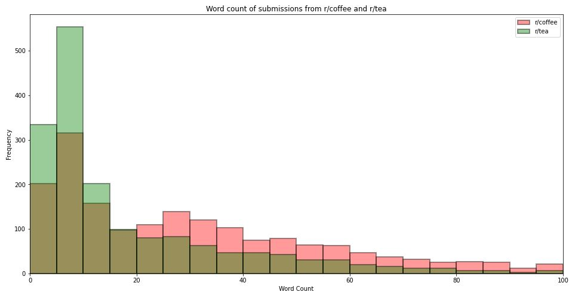

It can be seen that there are more shorter posts (less than or equal to 25 words) in the tea subreddit as compared those from r/coffee. For longer posts, this trend is reversed.

## Unigram EDA

Next, we looked at the top 20 most observed unigrams in each subreddit. They are displayed here:

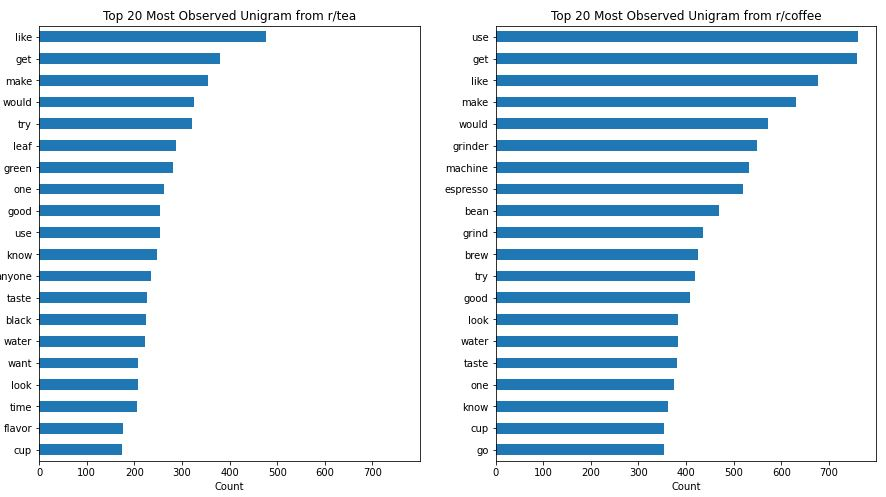


It is observed that there are numerous common, most observed words in both subreddits, such as like, get, make, would. Though there are some unique words that are quite telling of which subreddit they are from.

From r/tea, we see words relating to the type of tea. For instance, 'green' and 'black'.

From r/coffee, we see words relating to coffee-making equipment such as 'grinder' and 'machine'.

## Bigram EDA

Next, we looked at the top 20 most observed bigrams of each subreddit. They are displayed here:

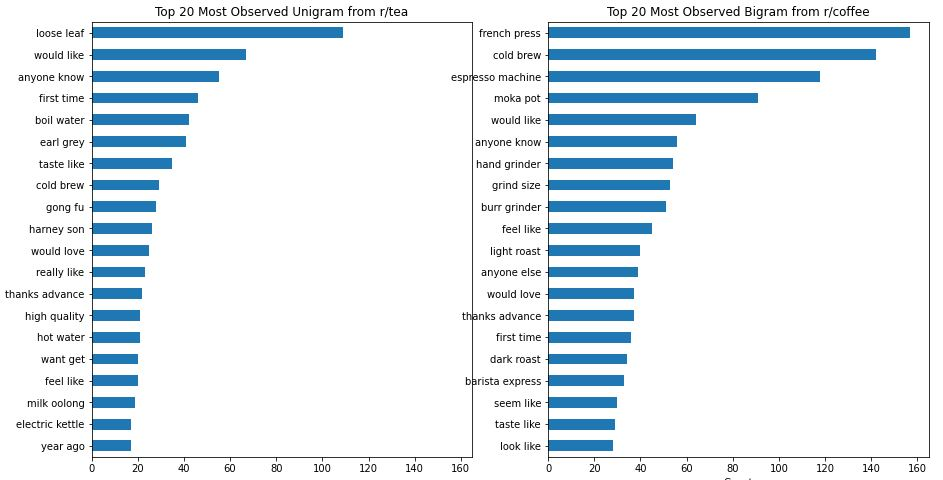


The bigram seems to be more informative than the unigram as it shows a wider variety of information on tea and coffee.

For r/tea, we have more information such as:

-   Way tea is sold: loose leaf - whole leaves of tea are packaged in containers rather than tea leave pieces in tea bags
-   Tea names: earl grey, milk oolong
-   Way tea is prepared: cold brew, and gong fu - a ceremonious way of brewing tea
-   Tea company: Harney & Son (ampersand was removed from text cleaning)
-   Equipment: electric kettle

For r/coffee, we have more information such as:

-   Equipment: french press, espresso machine, moka pot, hand grinder, burr grinder, barista express
-   Way coffee is prepared: cold brew
-   Way coffee bean is preprocessed: light roast, dark roast

## Trigram EDA

Next, we looked at the top 20 most observed trigrams in each subreddit. They are displayed here:

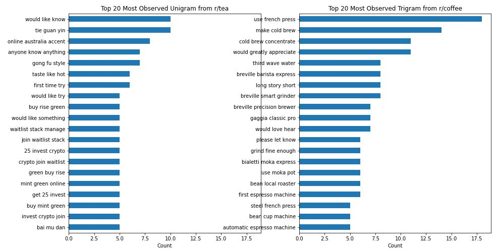


For trigrams, there do not seem to be additional information as compared to what was shown in bigrams.

For r/tea, the additional information primarily includes types of tea, such as tie guan yin and bai mu dan. However, trigram shows us that there are some spam or advertisements in the tea subreddit texts as seen from 'stack manage portfolio', 'waitlist stack manage', and '25 invest crypto'.

For r/coffee, there is limited information we can gather from trigram that are not seen in bigrams. Primarily, the additional information are the brands of machinery: Breville, Gaggia, Bialetti.

# Machine Learning Models
The two transformer methods are CountVectorizer and Term Frequency–Inverse Document Frequency (TF-IDF).

The classifier models used are Multinomial Naive Bayes, Bernoulli Naive Bayes, and Random Forest.

The models used have gone through hyperparameter tuning and these hyperparameters are used to produce the metric we are most interested in - accuracy. This is because we would want our model to be able to correctly classify tea and coffee whenever a person looks up a word that is related to either of those categories.

## Baseline
The baseline has an accuracy of close to 50%. This is based on the number of submissions that was scrapped from each subreddit.

## CountVectorizer Multinomial Naive Bayes
After transforming the 'text' column data with CountVectorizer and the parameters tuned, the confusion matrix and the ROC are:

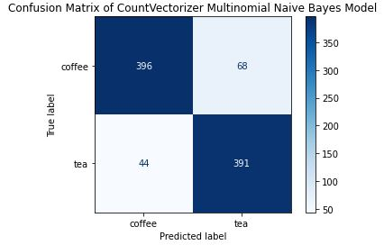

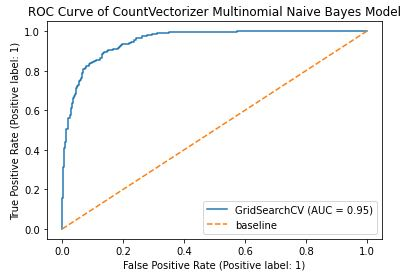

## CountVectorizer Bernoulli Naive Bayes
After transforming the 'text' column data with CountVectorizer and the parameters tuned, the confusion matrix and the ROC are:

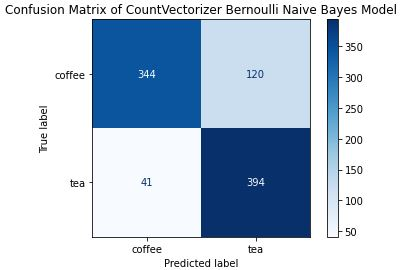

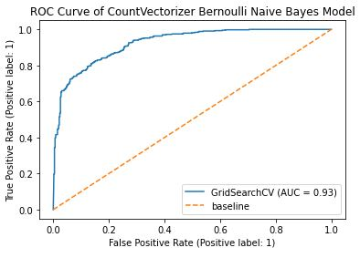

## TF-IDF Multinomial Naive Bayes
After transforming the 'text' column data with TF-IDF and the parameters tuned, the confusion matrix and the ROC are:

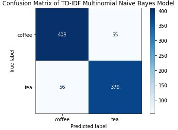

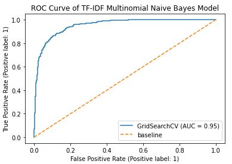


## TF-IDF Bernoulli Naive Bayes
After transforming the 'text' column data with TF-IDF and the parameters tuned, the confusion matrix and the ROC are:

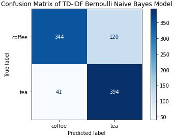

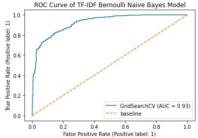

## CountVectorizer Random Forest
After transforming the 'text' column data with CountVectorizer and the parameters tuned, the confusion matrix and the ROC are:

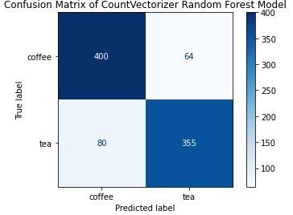

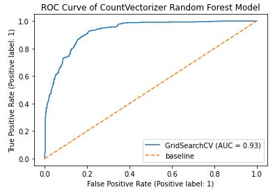

## TF-IDF Random Forest
After transforming the 'text' column data with TF-IDF and the parameters tuned, the confusion matrix and the ROC are:

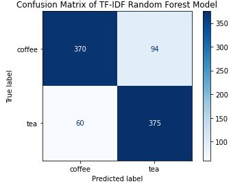

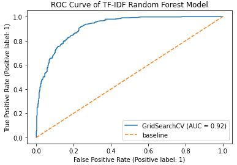

# Summary of Accuracy
The following plot summarizes the accuracy of the 5 models that were ran:

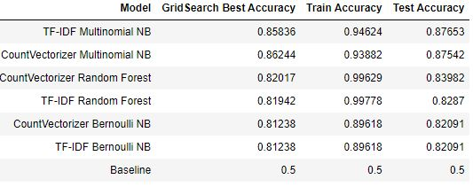
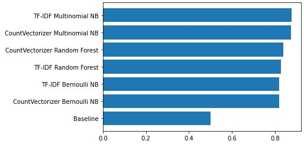

Based on the test accuracy, the best model we would recommend using is the TF-IDF Multinomial Naive Bayes Model.

# Top Predictor Words
The following plots summarizes the top 10 predictor words from the recommended model for both tea and coffee:

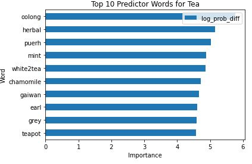
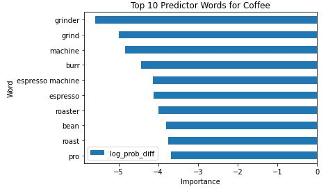