# Project 3

## Background
I am part of the data science team working in a beverage company, Coftea, specializing in coffee and tea. With the rise of numerous e-commerce platforms and numerous competitors in this space, it is important that the decisions made are founded on data in order to standout from the crowd.

## Problem Statement
To optimize our marketing expenditure, we would like to target our advertisements to people who are most likely going to buy our products. A good proxy would be their past search results. Also, buzz in the forums would give us a good indication of upcoming and fading trends so that we are more informed of our R&D focus and stock re-filling. My team and I are presenting to fellow colleagues and management who are non-technical, to share our findings on a recent project to build a classification model for the company that would be the foundation of this optimization.

## Data Used
* ['df_coffee.csv'](./data/df_coffee.csv): The titles, descriptions and subreddit thread (r/coffee) of 2000 submissions.
* ['df_tea.csv'](./data/df_tea.csv): The titles, descriptions and subreddit thread (r/tea) of 2000 submissions.

## Data Dictionary

### df_tea

|Feature|Type|Dataset|Description|
|---|---|---|---|
|subreddit|object|Scrapped from r/tea|Reddit thread the post is from|
|selftext|object|Scrapped from r/tea|Additional information to the title|
|title|object|Scrapped from r/tea|Title of the submission|
|created_utc|integer|Scrapped from r/tea|Unix time submission is made|

### df_coffee

|Feature|Type|Dataset|Description|
|---|---|---|---|
|subreddit|object|Scrapped from r/coffee|Reddit thread the post is from|
|selftext|object|Scrapped from r/coffee|Additional information to the title|
|title|object|Scrapped from r/coffee|Title of the submission|
|created_utc|integer|Scrapped from r/coffee|Unix time submission is made|

## Cleaning Data
First, there is a need to clean data. The first step is to drop the created_utc column that was only used for the function to scrap submissions from the two subreddits.

This is followed by converting and checking data type to be strings/object. 

Next is to correct the misspelling of words that are commonly seen in either of the subreddits. An example is converting all misspelling of pu'er (such as pu'erh, pu'erhh, etc.) into pu'er. This is done because Python cannot understand that the posters who spell it right and those who spell it wrong are referring to the same thing.

Obvious, unwanted words are removed, such as nan (a result of converted empty 'sefttext' to a string type), [removed], and [deleted], the latter two are due to the moderator's intervention.

The next step is to remove links by using regular expression to remove any text before the next whitespace that is followed by 'http'.

For the ease of further cleaning steps, the 'selftext' and 'title' columns in both datasets are tokenized.

After tokenizing, the words are converted to lowercase for consistency and any punctuations trailing any word are removed.

Lastly, two columns of each subreddits are lemmatized so that each word will be converted to their root words and a set of curated stop words (composed of the default ones in the library and those added after looking at the commonly observed word plots that are not indicative of the subreddit they are from) is used to filter out those that are present in the lemmatized columns.

## Feature Engineering
Feature engineering is only limited to creating a new column that combines the cleaned columns of 'selftext' and 'title' into 'text' which will then be used to train and test the models. Duplicated of this new columns are dropped.

## Exploratory Data Analysis (EDA)
The first EDA done is on the length of the submissions in both subreddits.

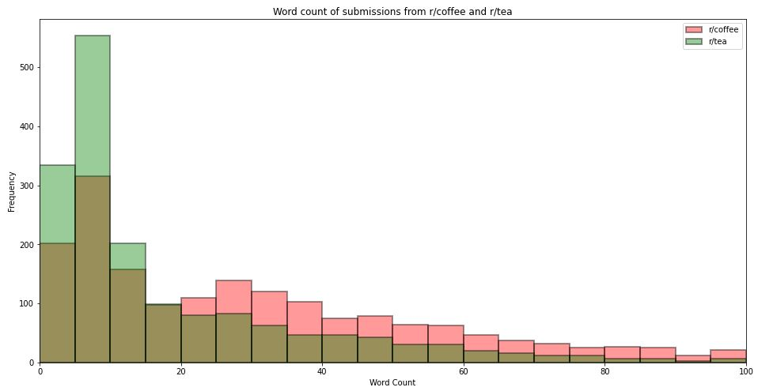

It can be seen that there are more shorter posts (less than or equal to 25 words) in the tea subreddit as compared those from r/coffee. For longer posts, this trend is reversed.

### One-gram EDA

Next, we looked at the top 20 most observed words in both subreddits. They are displayed here:

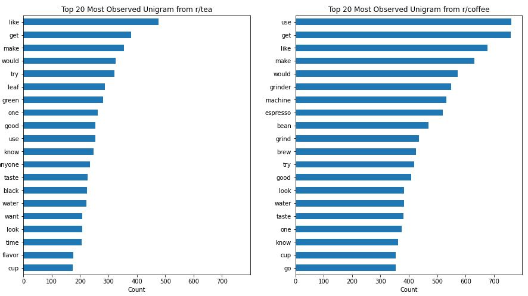

The above plots show the top 20 words that are most frequently observed. It is observed that there are many words in the respective subreddits that are indicative of which subreddit they are from. 

 For tea, the very telling words are leaf, the type of tea, and equipment used to make tea, such as kettle and teapot.

For coffee, the very telling words are the type of coffee beans, and the equipment of grinder.

### Two-gram EDA

Next, we looked at the top 20 most observed pairs of words in both subreddits. They are displayed here:

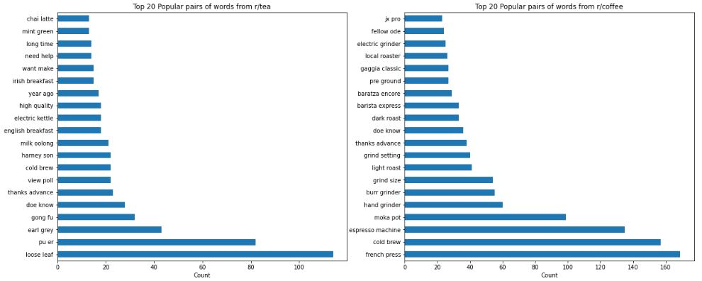

The above plots show the top 20 words that are most frequently observed. Compared to the most frequently observed single words, the most frequently observed pairs of words are also indicative of the subreddit they come from.

For tea, the very telling pairs are loose leaf and the type of tea leaves.

For coffee, the very telling pairs are the type of coffee beans and terms relating to coffee brewing equipment such as grind setting.

### Three-gram EDA

Next, we looked at the top 20 most observed trio of words in both subreddits. They are displayed here:

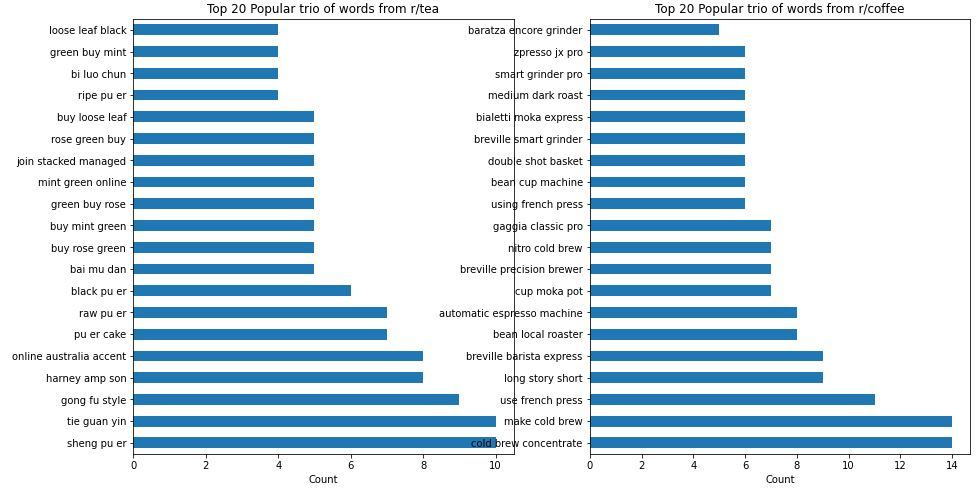

The above plots show the top 20 words that are most frequently observed. There seems to be a mix of informative and telling trio of words but also words that do not make sense on its own. 

 For tea, we uncover more types of tea with three words but get additional, unnecessary word where two of the three words would make more sense, for instance green rose makes more sense than green buy rose.

 For coffee, we have more terms about the coffee brewing machinery, types of brew, though interestingly the issue of redundant words in a trio is not as prevalent.

## Machine Learning Models
The two transformer methods are CountVectorizer and Term Frequency–Inverse Document Frequency (TF-IDF).

The classifier models used are Multinomial Naive Bayes, Bernoulli Naive Bayes, and Random Forest.

The models used have gone through hyperparameter tuning and these hyperparameters are used to produce the metric we are most interested in - accuracy. This is because we would want our model to be able to correctly classify tea and coffee whenever a person looks up a word that is related to either of those categories.

### Baseline
The baseline has an accuracy of close to 50%. This is based on the number of submissions that was scrapped from each subreddit.

### CountVectorizer Multinomial Naive Bayes
After transforming the 'text' column data with CountVectorizer and the parameters tuned, the confusion matrix and the ROC are:

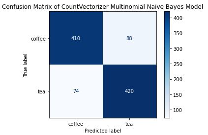

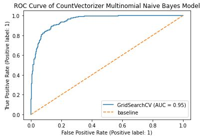

### CountVectorizer Bernoulli Naive Bayes
After transforming the 'text' column data with CountVectorizer and the parameters tuned, the confusion matrix and the ROC are:

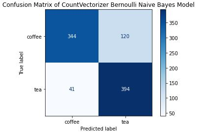

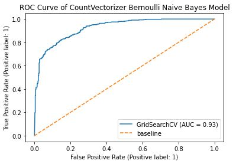

### TF-IDF Multinomial Naive Bayes
After transforming the 'text' column data with TF-IDF and the parameters tuned, the confusion matrix and the ROC are:

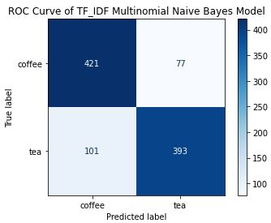

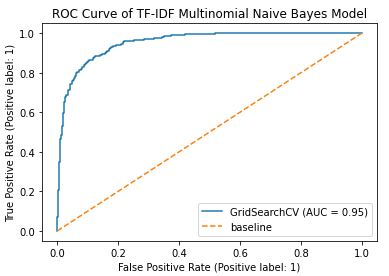

### TF-IDF Bernoulli Naive Bayes
After transforming the 'text' column data with TF-IDF and the parameters tuned, the confusion matrix and the ROC are:

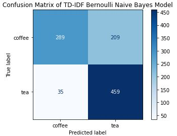

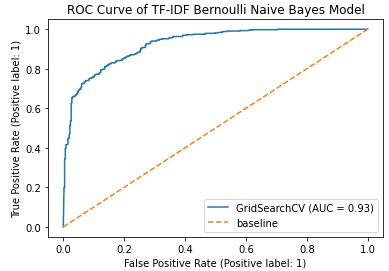

### CountVectorizer Random Forest
After transforming the 'text' column data with CountVectorizer and the parameters tuned, the confusion matrix and the ROC are:

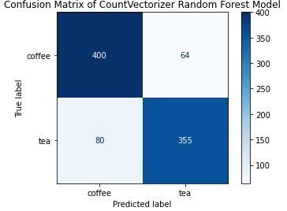

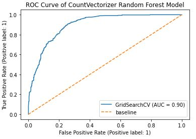

## Summary of Accuracy
The following plot summarizes the accuracy of the 5 models that were ran:

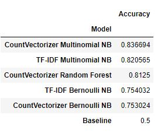
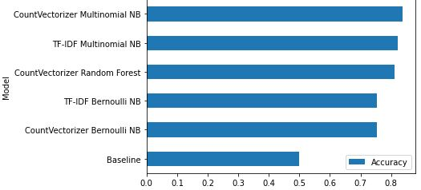

## Top Predictor Words
The following plots summarizes the top 10 predictor words for both tea and coffee:

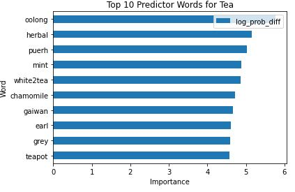
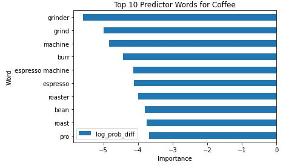

## Limitations and Future Steps

### Limitations
1. There is a need to have a dictionary to map common misspellings of important words which may be tedious at first given that we would only be able to pick up such specific misspellings after witnessing it the first few times. There may be instances where misspelled words are used to train the model.

2. There is a need to have another dictionary to address multi-word names of tea types, coffee types, and equipment. This result in many not meaningful analysis when plotting the frequently occurring words during our EDA phase, but makes more sense in our two-grams. Need to map all these terms to a single word by removing spaces.

3. Update dictionary of stop words as there are many words that are irrelevant to helping the model correctly classify which of the category a given word belongs to.

### Future Steps
1. Can use a larger dataset by either scrapping more submissions from the reddit threads or getting text data from more localized forums such as hardwarezone, posts are more indicative of the sentiments of posters from the Asian region. This would be more relevant should the Asian market be the primary target audience of our advertisements.

2. Given the foundation is laid, we may look into analyzing text data that are not in English, opening up the prospect of tapping into foreign markets.

3. Additional offerings can be provided if we are able to foresee uprising hype for coffee or tea derivative products such as coffee-flavored candies.

4. Use models that are catered to analyze visual data, especially relevant for threads with little words in their submissions but are accompanied with images or videos.
